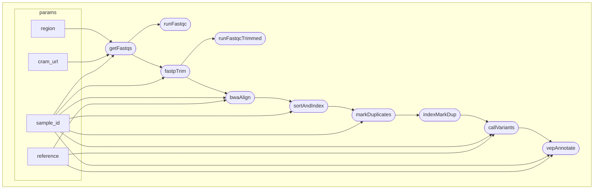

# HEXA Varint Analysis
a custom Nextflow pipeline for investigating the signficance of variants on and flanking the HEXA locus of human chromosome 15

## Background
The HEXA gene codes for the enzyme Hexosaminidase A which catalyzes the degredation of G<sub>M2</sub> gangliosides in brain cell lysosomes. HEXA codes for the alpha subunit of Hexosaminidase, while HEXB codes for the beta subunit. Mutations to the HEXA gene can result in nonfunctional Hexosaminidase enzymes, which leads to decreased hydrolysis of gangliosides and thus build up of gangliosides in lysosomes. (Mahuran, 1990) The rare genetic lysosomal storage disease Tay-Sachs is caused by a mutation to the HEXA gene. Here, we present a pipeline for investigating genomic variants in and around the HEXA gene from a sequenced chromosome 15. This pipeline should be able to detect Tay-Sachs causing variants, most commonly a TATC insertion on exon 11 of the HEXA gene, but others exist at lower frequencies, and explore other variants in the gene and flanking regulatory regions (Mistri et al., 2012).

## Pipeline Overview

Inputs to the pipeline (specified in the params in the main.nf file):

| Input file | Description | Example
| --- | --- | --- |
| Sample ID | The sequenced genome that the sample is pulled from | HG00096 |
| CRAM URL | A URL to a remote .cram file containing the sample chr15 genomic data | http://ftp.1000genomes.ebi.ac.uk/vol1/.../.cram |
| Region | Genomic coordinates to the HEXA gene and flanking regions on chr15 | chr15:72335000-72382000 |
| Reference | The reference genome which the sample is aligned against to call variants | chr15.fa |

A graph depicting the flow of inputs through processes to outputs, and a description of each process:



| Process | Function | Input | Output |
| --- | --- | --- | --- |
| `getFastqs` | Download the HEXA region of chromosome 15 from a CRAM URL for both the forward and reverse strands | sample ID, CRAM URL for desired genome, and HEXA coordinates on CHR15 | sample_id.HEXA.R1.fastq.gz, sample_id.HEXA.R2.fastq.gz |
| `runFastqc` | run Fastqc to confirm quality of input HEXA region | R1 HEXA region, R2 HEXA region | fastqc.html, fastqc.zip |
| `fastpTrim` | Adaptor and quality based trimming of the input HEXA region fastq files | R1 HEXA region, R2 HEXA region | Trimmed R1 HEXA region, trimmed R2 HEXA region, HEXA.fastp.html, HEXA.fastp.json |
| `runFastqcTrimmed` | run Fastqc on trimmed files to show quality improvements over raw fastq files | Trimmed R1 HEXA region, trimmed R2 HEXA region | fastqc_trimmed.html, fastqc_trimmed.zip |
| `bwaAlign` | Map trimmed fastq reads to a chromosome 15 reference genome | sample_id, Trimmed R1 HEXA region, trimmed R2 HEXA region, Chr15 reference | *.chr15.sam aligned file |
| `sortAndIndex` | Sort and index aligned SAM file for downstream variant calling and annotation, and convert to BAM format | *.chr15.sam, sample ID | chr15.sorted.bam, chr15.sorted.bam.bai (index file) |
| `markDuplicates` | Mark duplicates and generate duplication metrics for downstream variant calling | chr15.sorted.bam, chr15.sorted.bam.bai (index file), sample ID | chr15.markdup.bam, chr15.markdup.metrics.txt |
| `indexMarkDup` | Index the duplicated marked alignment | chr15.markdup.bam | chr15.markdup.bam.bai (index file) |
| `callVariants` | Call variants from the duplicate marked alignment into a VCF file | sample ID, chr15 reference, chr15.markdup.bam, chr15.markdup.bam.bai (index file) | chr15.vcf.gz |
| `vepAnnotate` | Annotate variant call VCF file with a local VEP cache, classifying variants by type, location, and predicted effects | sample ID, chr15 reference, chr15.vcf.gz | vep.vcf, vep.vcf_summary.html |

## Methodology Overview

This pipeline takes a sample genome slice from chr15:72335000-72382000, coordiantes corresponding to the GrCh38 human reference genome, and aligns it against that same reference genome, calls SNVs, indels, and structural variants, and then annotates those variants Ensembl Variant Effect Predictor (VEP). We call a number of standard tools for quality control and filtering, alignemnt, variant calling, and annotation. 

Note: Running this pipeline requires a local download of the chromosome 15 slice of the GrCh38 human reference genome and a local VEP cache for annotation, totalling ~25 GB. These downloads are setup and not analysis, and are thus excluded from the pipeline. Instructions for installing these depedencies can be found below in the use section.

First, raw fastq files containing the chr15:72335000-72382000 HEXA slice of a sample genome are downloaded via an ftp link with `getFastqs`. One file for the forward strand, and another for the reverse complement strand so all possible variants are aligned to the reference genome. 

The forward (R1) and reverse complement (R2) fastq files are passed to `runFastqc`, which generates an HTML quality control report for the unfiltered fastq files. Simultaniously, the fastqs are passed to `fastpTrim` which trims low quality bases, potentially leftover adaptors, and polyX heads or tails on the chromosome 15 HEXA slice. The trimmed R1 and R2 fastqs are passed to `runFastqcTrimmed` which generates the same report as `runFastqc` on the trimmed file, which should show higher quality metrics. Now the reads are trimmed and prepared for downstream alignment, duplicate marking, and variant calling. 

`bwaAlign` takes in the trimmed fastqs and aligns them to the GrCH38 chromosome 15 reference using the `bwa-mem` alignment tool. The resulting alignment is in SAM format. 

The SAM format alignment is sorted, indexed, and converted to the binary BAM format with `sortAndIndex`, which calls the `samtools` package. Thus produces an accessory .bam.bai index file for efficent duplicate marking. 

Next, `markDuplicates` flags duplicate regions of the alignment that resulted from overamplification of certain regions during the sequencing process, such that each found variant in downstream variant calling is not counted multiple times over, which skews the variant count and annotation results. This results in a duplicate marked BAM file, which is passed to `indexMarkDup` which creates an index .bam.bai file for the new duplicate marked alignment. 

Now the alignment is prepared for variant calling with `callVariants` which identifies variants with the `bcftools` package. This process produces a VCF file containing each variant identified in the alignment along with its coordinates. 

Finally, the VCF file is used as input to Ensembl's VEP (variant effect predictor), which uses a cache of known variant information to classify variants by type, location, predicted effects, and if they are present in clinical variant databases including gnomAD and ClinVar. THis produced a new VCF file and an HTML report containing summaries of the predicted variant effects and variant classifications. 

Pipeline development note: Downloading the 47kb HEXA region of Chr15 from the GrCh38 build creates its own naming and coordiate system starting at 1. This reference would be useless because the coordinates would not match their true Chr15 coordinates that the aligned reads carry and that VEP can annotate. This was our original download of the Chr15 region. `prepare_reference.sh` fixes this by pulling all of Chr15 and then slicing to the window rather than just downloading the window, so reference naming and coordinate information is carried forward.

## Usage

Instructions on preparing and running the pipeline

### Prerequisites
* Nextflow Ver. 26.x or more recent and Java 11+ (pipeline tested with Nextflow version 26.04.6)
* Docker (Desktop or Engine) running with `docker.enabled`
* ~25 GB free disk space for reference + VEP cache
* `curl` and `tar` (standard macOS/Linux tools) for setup scripts

Apple Silicon note: enable Rosetta in Docker Desktop. Containers are linux/amd64.

### Running the pipeline:
* Clone this repository
* Run `bash scripts/prepare_reference.sh` to download, trim, and index the reference genome
* Run `bash scripts/download_vep_cache.sh` to download and unpack the VEP cache for annotation
* Run the pipeline with `nextflow run main.nf`
* Optional: Run `summarize_results.sh` to filter for HEXA-overlapping variants and variants predicted to be high impact. Call the tool from the command line with `bash scripts/summarize_results.sh results/vep/HG00096.chr15.vep.vcf`. Note that the script takes the input vcf as a positional argument to pass vcfs generated from other samples or runs.

Results are written to HEXA_pipeline/results. The results file structure is as follows:

```
results
├── bam
│   ├── HG00096.chr15.sorted.bam
│   └── HG00096.chr15.sorted.bam.bai
├── bwa-mem
│   └── HG00096.chr15.sam
├── fastp_trimmed
│   ├── HG00096.HEXA.fastp.html
│   ├── HG00096.HEXA.fastp.json
│   ├── HG00096.HEXA.trimmed.R1.fastq.gz
│   └── HG00096.HEXA.trimmed.R2.fastq.gz
├── fastq
│   └── gzipped
│       ├── HG00096.HEXA.R1.fastq.gz
│       └── HG00096.HEXA.R2.fastq.gz
├── fastqc
│   ├── HG00096.HEXA.R1_fastqc.html
│   ├── HG00096.HEXA.R1_fastqc.zip
│   ├── HG00096.HEXA.R2_fastqc.html
│   └── HG00096.HEXA.R2_fastqc.zip
├── fastqc_trimmed
│   ├── HG00096.HEXA.trimmed.R1_fastqc.html
│   ├── HG00096.HEXA.trimmed.R1_fastqc.zip
│   ├── HG00096.HEXA.trimmed.R2_fastqc.html
│   └── HG00096.HEXA.trimmed.R2_fastqc.zip
├── markDuplicates
│   ├── HG00096.chr15.markdup.bam
│   ├── HG00096.chr15.markdup.bam.bai
│   └── HG00096.chr15.markdup.metrics.txt
├── variants
│   └── HG00096.chr15.vcf.gz
└── vep
    ├── HG00096.chr15.vep.vcf
    ├── HG00096.chr15.vep.vcf_summary.html
    ├── clinvar_hexa.chr15.vep.vcf
    └── clinvar_hexa.chr15.vep.vcf_summary.html
```

Final annotation results are found in `HG00096.chr15.vep.vcf_summary.html` 

## Results

The pipeline identified 55 variants in the Chr15:72,335,000-72,382,000 window for HG00096, all of which passed annotation with VEP. 84% (46/55) were known variants with exisitng dbSNP identifiers, which is consistent with variant alling a well-characterized region of a reference-cohort sample. The remaining 9 variants were novel. Variants overlapped 4 genes including HEXA distributed across consequence types:

* 37 intron variants
* 8 non-coding transcript exon variants
* 6 3 prime UTR variants
* 1 missense variant
* 1 synonymous variant
* 1 splice polypyrimidine tract variant
* 1 upstream gene variant

Of the 55 variants called in the window, 49 (89%) overlap the HEXA gene body, including introns and UTRs. of these 49 variants, 37 are intronic, which is consistent with HEXA itself being primarily comprised of intron sequences. No variants were predicted to be high impact (nonsense, fameshift, splice-distrupting) by VEP, and none altered the HEXA protein coding sequence. This is the expected profile for a general population sample: the pathogenic HEXA allele underlying Tay-Sachs are enriched by a founder effect in specific populations (Ashkenazi Jewish, French Canadian) rather than being distributed broadly across the population, so their abscence here is anticipated rather than a null result.

Note: downstream VEP filtering for HEXA-overlapping variants and variants predicted to be high impact were found using `summarize_results.sh` Instructions on running this file can be found in the Usage section.

## Predictor concordance with ClinVar classifications

to assess concordance between the pipeline's PolyPhen annotations and ClinVar classifications, I took ClinVar's HEXA variants (pinned release to 09/23/2026, subset to the gene region, rename contigs to match reference), and ran them through the pipeline's VEP annotation step and compared PolyPhen predictions against ClinVar's clinical classifications.

### Usage

To run this analysis, first download the pinned release of ClinVar's GRCh38 clinical variant VCF file with `bash download_clinvar.sh`. Then subset the VCF to the same HEXA region used in the rest of the pipeline with `bash subset_clinvar_vcf.sh`. 

Run the VEP step of the pipeline with the ClinVar VCF against the reference with:
`nextflow run main.nf --annotate_only true --input_vcf data/clinvar/hexa_clinvar_chr15.vcf.gz`

Finally, build a table of variant classifications where the rows are ClinVar's classifications and the columns are PolyPhen's effect predictions with `polyphen_analysis.py`. This produces the table at the bottom of this section. I collapsed it into the following smaller table:

### Results

| ClinVar group | benign | possibly_damaging | probably_damaging | n |
|---|---|---|---|---|
| Pathogenic / Likely pathogenic | 20 | 12 | 45 | 77 |
| Benign / Likely benign | 36 | 3 | 1 | 40 |
| Uncertain significance | 233 | 57 | 78 | 368 |
| Conflicting classifications | 8 | 6 | 9 | 23 |

PolyPhen called 57 varaints pathogenic out of 77 confirmed pathogenic variants, with 20 total pathogenic variants marked as benign. The benign set was small and called 36 benign out of 40 confirmed benign variants. 37% of the 368 variants of uncertain significance (VUS) are flagged as possibly or probably damaging. There are a small number of conflicting classifications that come from ClinVar variants with multiple entries in the VCF from different labs that reached differing conclusions about the variant.

### Discussion

PolyPhen flagged most pathogenic-side variants as damaging but called 20 of 77 benign. Agreement on the benign side was high, though the sample size was small at n=40. 134 of 367 uncertain significance variants got a damaging call. This analysis was not built to benchmark Polyphen, just to demonstrate that the pipeline can annotate external variant sets.

### Limitations

The benign set is too small to estimate sensitivity or specificity. The canonical HEXA transcript had no PolyPhen data, so transcript selection was pragmatic to test variant prediction efficacy. PolyPhen's training data may overlap with ClinVar's catalogued variants, so some variants may not be independent test cases (Grimm et al., 2015). This is especially true for a well studied gene like HEXA, where its catalogued variants could end up in training data for prediction algorithms. This is a case for a single gene, and cannot be generalized to other genes or the whole genome.

### Full table
Rows are ClinVar's classifications of variants, and columns are PolyPhen's predictions of variant significance. 

| ClinVar classification | benign | possibly_damaging | probably_damaging |
|---|---|---|---|
| Affects | 0 | 0 | 2 |
| Benign | 1 | 0 | 0 |
| Benign/Likely_benign | 2 | 1 | 0 |
| Benign/Likely_benign\|other | 0 | 0 | 1 |
| Conflicting_classifications_of_pathogenicity | 8 | 5 | 9 |
| Conflicting_classifications_of_pathogenicity\|other | 0 | 1 | 0 |
| Likely_benign | 33 | 2 | 1 |
| Likely_pathogenic | 13 | 8 | 15 |
| Pathogenic | 4 | 1 | 13 |
| Pathogenic/Likely_pathogenic | 3 | 3 | 17 |
| Uncertain_significance | 233 | 56 | 78 |
| Uncertain_significance\|Affects | 0 | 1 | 0 |
| no_classification_for_the_single_variant | 1 | 0 | 0 |

## Next Steps

This pipeline can be extended in two steps that would broaden the analysis from single genome variant calling to HEXA variant population frequency analysis

V2 - **Multiple Samples**. Extend the pipeline to process a cohort of input genomes in one run. Refactor the process to have samples carry identifiers through the whole workflow so outputs do not collide and so samples stay tracked. Organize output by input sample and generate cohort-wide variant statistics report.

V3 - **Population Frequency Analysis**. Compare HEXA variant frequencies across the input samples cohort against reference population data from a known Tay-Sachs affected population. Tay-Sachs pathogenic alleles are enriched in specific population via a historical bottleneck, so the analysis targets specific, known founder variants, and compares their frequency to whatever cohort is used as input, for example a subsample of the general population, or a current subsample of Asheknazi Jewish people.

**Small Addition**: Swap bcftools variant calling for GATK HaplotypeCaller which is more robust for population wide variant calling

## References

1000 Genomes | A Deep Catalog of Human Genetic Variation. (n.d.). Retrieved August 30, 2026, from https://www.internationalgenome.org/

Adzhubei, I., Jordan, D. M., & Sunyaev, S. R. (2013). Predicting functional effect of human missense mutations using PolyPhen-2. Current protocols in human genetics, Chapter 7, Unit7.20. https://doi.org/10.1002/0471142905.hg0720s76

Auton, A., Abecasis, G. R., Altshuler, D. M., Durbin, R. M., Abecasis, G. R., Bentley, D. R., Chakravarti, A., Clark, A. G., Donnelly, P., Eichler, E. E., Flicek, P., Gabriel, S. B., Gibbs, R. A., Green, E. D., Hurles, M. E., Knoppers, B. M., Korbel, J. O., Lander, E. S., Lee, C., … National Eye Institute, N. (2015). A global reference for human genetic variation. Nature, 526(7571), 68–74. https://doi.org/10.1038/nature15393

Babraham Bioinformatics—FastQC A Quality Control tool for High Throughput Sequence Data. (n.d.). Retrieved August 30, 2026, from https://www.bioinformatics.babraham.ac.uk/projects/fastqc/

Chen, S., Zhou, Y., Chen, Y., & Gu, J. (2018). fastp: An ultra-fast all-in-one FASTQ preprocessor. Bioinformatics, 34(17), i884–i890. https://doi.org/10.1093/bioinformatics/bty560

Danecek, P., Bonfield, J. K., Liddle, J., Marshall, J., Ohan, V., Pollard, M. O., Whitwham, A., Keane, T., McCarthy, S. A., Davies, R. M., & Li, H. (2021). Twelve years of SAMtools and BCFtools. GigaScience, 10(2), giab008. https://doi.org/10.1093/gigascience/giab008

Di Tommaso, P., Chatzou, M., Floden, E. W., Barja, P. P., Palumbo, E., & Notredame, C. (2017). Nextflow enables reproducible computational workflows. Nature Biotechnology, 35(4), 316–319. https://doi.org/10.1038/nbt.3820

Grimm, D. G., Azencott, C. A., Aicheler, F., Gieraths, U., MacArthur, D. G., Samocha, K. E., Cooper, D. N., Stenson, P. D., Daly, M. J., Smoller, J. W., Duncan, L. E., & Borgwardt, K. M. (2015). The evaluation of tools used to predict the impact of missense variants is hindered by two types of circularity. Human mutation, 36(5), 513–523. https://doi.org/10.1002/humu.22768

Li, H. (2013). Aligning sequence reads, clone sequences and assembly contigs with BWA-MEM (arXiv:1303.3997). arXiv. https://doi.org/10.48550/arXiv.1303.3997

Mahuran, D. J., Triggs-Raine, B. L., Feigenbaum, A. J., & Gravel, R. A. (1990). The molecular basis of Tay-Sachs disease: Mutation identification and diagnosis. Clinical Biochemistry, 23(5), 409–415. https://doi.org/10.1016/0009-9120(90)90153-L

McLaren, W., Gil, L., Hunt, S. E., Riat, H. S., Ritchie, G. R. S., Thormann, A., Flicek, P., & Cunningham, F. (2016). The Ensembl Variant Effect Predictor. Genome Biology, 17(1), 122. https://doi.org/10.1186/s13059-016-0974-4

Mistri, M., Tamhankar, P. M., Sheth, F., Sanghavi, D., Kondurkar, P., Patil, S., Idicula-Thomas, S., Gupta, S., & Sheth, J. (2012). Identification of Novel Mutations in HEXA Gene in Children Affected with Tay Sachs Disease from India. PLOS ONE, 7(6), e39122. https://doi.org/10.1371/journal.pone.0039122

Picard Tools—By Broad Institute. (n.d.). Retrieved August 30, 2026, from https://broadinstitute.github.io/picard/


